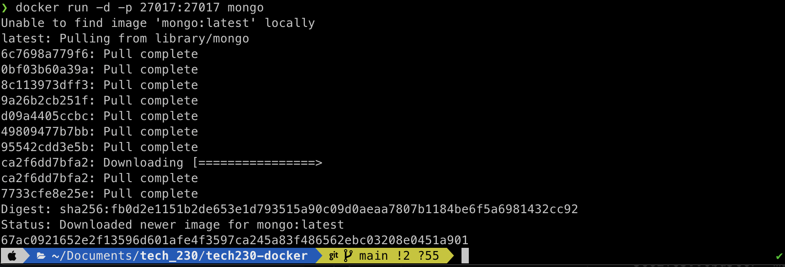
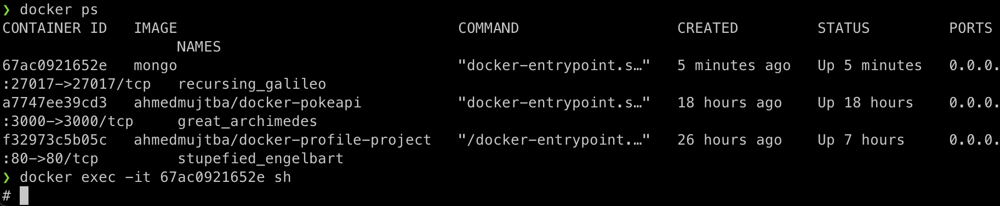
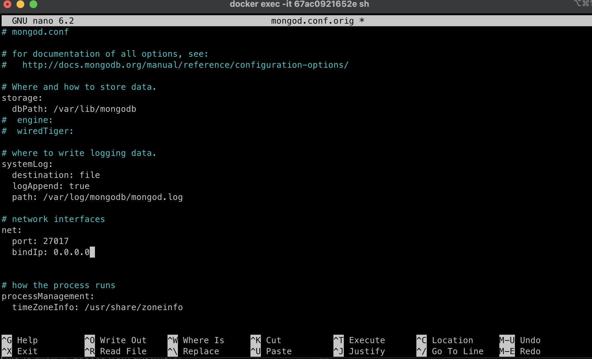
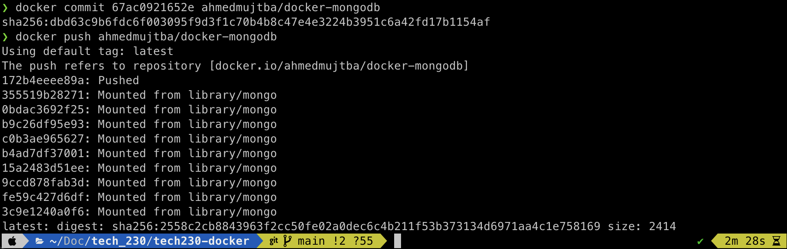

# How to Build a customised Mongo image with mongo.conf configuration

1. You can run a MongoDb image by running the command below:

```
docker run -d -p 27017:27017 mongo
```

Output:



2. Now we want to connect to the container, use the command below:

```
docker ps
```

- Copy the container id and use it in the command below:

```
docker exec -it <container-id> sh
```

Output:



3. Now we need to install all the required dependencies and install sudo and nano:

```
apt update -y

apt upgrade -y

apt install sudo -y

sudo apt install nano -y
```

4. We need to change the bindIp from `127.0.0.1` to `0.0.0.0` so run the following command and make the change as shown in the screenshot below:

```
cd etc/mongod.conf.orig
```

Output:



5. We can now commit these changes and create our mongoDB image, this will also create a repo on dockerhub.

```
docker commit <container-id> ahmedmujtba/docker-mongodb
```

6. Now that our image has been created, we can push these changes to dockerhub using this command:

```
docker push ahmedmujtba/docker-mongodb
```

Output:


