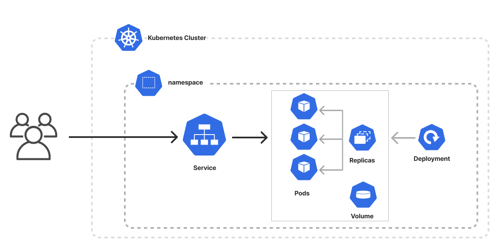
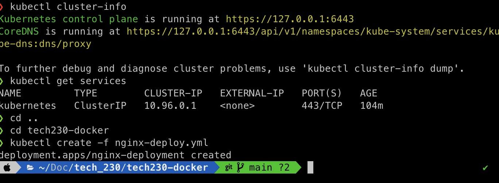
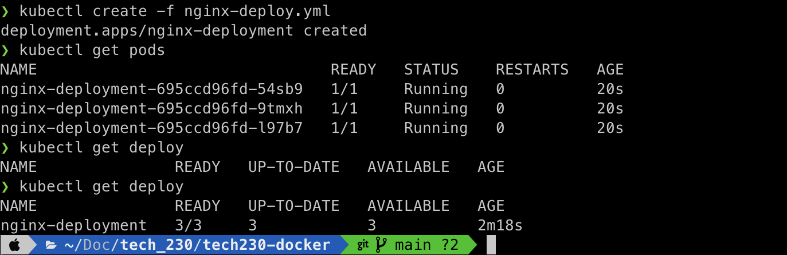

# K8 Architecture



```
kubectl get services
```

how to write yaml file using api's

```
#what would you like to call it

apiVersion: apps/v1 # which api to use for deployment
kind: Deployment # pod -
metadata:
  name: nginx-deployment # naming the deployment
spec:
  selector:
    matchLabels:
      app: nginx # look for this label to match with k8 services
    # create a replica set of this with instances/pods
  replicas: 3
    # template to use it's label for k8 service
  template:
    metadata:
      labels:
        app: nginx # This label connects to the service or any other k8 components
    spec:
      containers:
      - name: nginx
        image: ahmedmujtba/docker-profile-project:latest
        ports:
        - containerPort: 80
```

once you have file, go to directory where the file is

kubectl create -f <filename>



kubectl get pods


kubectl get deploy



sudo nano nginx-service.yml

```

apiVersion: v1
kind: Service
metadata:
  name: nginx-svc # naming the deployment
  namespace: default # sre , not needed unless in production, keeps things separated
spec:
  ports:
  - nodePort: 30001 # range is 30000-32768
    port: 80
    # port mapping

    targetPort: 80
  selector:
    app: nginx # look for this label to match with k8 services

  type: NodePort


```

research namespace

kubectl create -f nginx-service.yml

![alt text]

kubectl get svc

![alt text]

profile on localhost:30001


self healing

kubectl delete pod (copy name from kubectl get pods)

when you run get pods again it'd still show 3 so it self healed.

kubectl get deploy

- to make changes to all pods
  kubectl edit deploy nginx-deployment

notedpad loads, change replicas to 5

zero downtime and edited appears in the edit deploy command

if something isn't working:

kubectl describe deploy nginx-deployment
kubectl describe svc nginx-service

# reasearch kubernetes labels and selectors

how to create multiple instances of same image we built ourselves

# How to deploy node app image with k8

sudo nano nodeapp-deploy.yml

```


apiVersion: apps/v1
kind: Deployment
metadata:
  name: nodeapp-deployment
spec:
  selector:
    matchLabels:
      app: sparta-app
  replicas: 3

  template:
    metadata:
      labels:
        app: sparta-app
    spec:
      containers:
      - name: sparta-app
        image: ahmedmujtba/tech230-docker:v1
        ports:
        - containerPort: 3000
```


sudo nano node-service.yml

```

apiVersion: v1
kind: Service
metadata:
  name: nodeapp-svc # naming the deployment
  namespace: default # sre , not needed unless in production, keeps things separated
spec:
  ports:
  - nodePort: 30005 # range is 30000-32768
    port: 3000
    # port mapping

    targetPort: 3000
  selector:
    app: sparta-app # look for this label to match with k8 services

  type: NodePort


```


# Db deployment

`sudo nano db-deploy.yml`

```
apiVersion: apps/v1
kind: Deployment
metadata:
  name: sparta-db
  labels:
    db: sparta-db
spec:
  selector:
    matchLabels:
      db: sparta-db
  replicas: 1
  template:
    metadata:
      labels:
        db: sparta-db
    spec:
      containers:
        - name: sparta-db
          image: ahmedmujtba/docker-mongodb:latest
          ports:
          - containerPort: 27017
          env:
          - name: DB_HOST
            value: sparta-db:27017/posts

```

`kubectl create -f db-deploy.yml`
`kubectl get deployment -A`
`kubectl get pods -A`
`kubectl exec -it sparta-db-745f95c94d-l67ps -- bash`

output:


`sudo nano db-service.yml`

```
apiVersion: v1
kind: Service
metadata:
  name: sparta-db-svc
spec:
  selector:
    db: sparta-db
  ports:
    - protocol: TCP
      port: 27017
      targetPort: 27017

```

`sudo nano db-deploy.yml`

```

```


